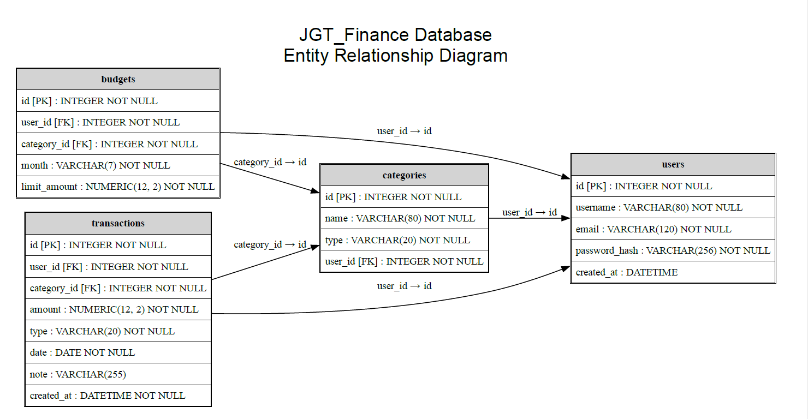

# SQL_TESTING.md

## Project Milestone 5: SQL Design

**Project:** JGT Personal Finance Dashboard

---

## Overview

This document describes the database schema, table relationships, SQL
access methods, and database verification tests for the JGT Personal
Finance Dashboard. It is intended for developers implementing the
backend.

This document answers:

- What tables exist?
- What fields and constraints exist?
- How are the tables related?
- What data access methods are required?
- Which pages use each table?
- How are the schema and access methods tested?

Backend stack:

- Flask
- Flask-SQLAlchemy
- SQLite
- Flask-Migrate / Alembic

---

# Database Tables

The application currently contains four primary tables:

- users
- categories
- transactions
- budgets

---

## Entity Relationship Diagram

## 1) Table: users

### Table Description

Stores user account and authentication information.

### Fields

| Field Name      | Description                            | Constraints                                            |
| --------------- | -------------------------------------- | ------------------------------------------------------ |
| `id`            | Unique user identifier                 | Primary key                                            |
| `username`      | User-selected login name               | String(80), NOT NULL, UNIQUE                           |
| `email`         | User email address                     | String(120), NOT NULL, UNIQUE                          |
| `password_hash` | Werkzeug-generated password hash       | String(256), NOT NULL                                  |
| `created_at`    | Timestamp when the account was created | DateTime, NOT NULL, database default current timestamp |

### Relationships

- One-to-many with categories
- One-to-many with transactions
- One-to-many with budgets

### Table Tests

**Use Case Name:** Create user account

**Description:** Verify a valid user can be stored.

**Pre-conditions:** Database initialized.

**Test Steps**

1. Insert valid user.
2. Query by username.

**Expected Result:** User exists with hashed password.

**Status:** Pass

---

## 2) Table: categories

### Table Description

Stores user income and expense categories.

### Fields

| Field Name | Description                | Constraints                                                |
| ---------- | -------------------------- | ---------------------------------------------------------- |
| `id`       | Unique category identifier | Primary key                                                |
| `name`     | Category display name      | String(80), NOT NULL                                       |
| `type`     | Category classification    | String(20), NOT NULL, CHECK value is `income` or `expense` |
| `user_id`  | User who owns the category | Integer, NOT NULL, foreign key to `users.id`               |

### Relationships

- Many-to-one with users
- One-to-many with transactions
- One-to-many with budgets

### Table Tests

**Use Case Name:** Create category

**Description:** Verify category creation.

**Pre-conditions:** User exists.

**Test Steps**

1.  Insert Food category.
2.  Query by user.

**Expected Result:** Category returned.

**Status:** Pass

---

## 3) Table: transactions

### Table Description

Stores income and expense transactions shown on the Dashboard and
Transaction History pages.

### Fields

| Field Name    | Description                           | Constraints                                                |
| ------------- | ------------------------------------- | ---------------------------------------------------------- |
| `id`          | Unique transaction identifier         | Primary key                                                |
| `user_id`     | User who owns the transaction         | Integer, NOT NULL, foreign key to `users.id`               |
| `category_id` | Category assigned to the transaction  | Integer, NOT NULL, foreign key to `categories.id`          |
| `amount`      | Transaction amount                    | Numeric(12,2), NOT NULL, CHECK amount is nonnegative       |
| `type`        | Transaction classification            | String(20), NOT NULL, CHECK value is `income` or `expense` |
| `date`        | Date the financial activity occurred  | Date, NOT NULL, default current date                       |
| `note`        | Optional transaction description      | String(255), nullable                                      |
| `created_at`  | Timestamp when the record was created | DateTime, NOT NULL, default current timestamp              |

### Relationships

- Many-to-one with users
- Many-to-one with categories

### Table Tests

**Use Case Name:** Create transaction

**Description:** Verify a transaction is stored.

**Pre-conditions:** User and category exist.

**Test Steps**

1. Insert transaction.
2. Query by user.

**Expected Result:** Transaction returned.

**Status:** Pass

---

## 4) Table: budgets

### Table Description

Stores monthly spending limits by category.

### Fields

| Field Name     | Description                            | Constraints                                          |
| -------------- | -------------------------------------- | ---------------------------------------------------- |
| `id`           | Unique budget identifier               | Primary key                                          |
| `user_id`      | User who owns the budget               | Integer, NOT NULL, foreign key to `users.id`         |
| `category_id`  | Category controlled by the budget      | Integer, NOT NULL, foreign key to `categories.id`    |
| `month`        | Budget month in `YYYY-MM` format       | String(7), NOT NULL, application validation          |
| `limit_amount` | Maximum planned spending for the month | Numeric(12,2), NOT NULL, CHECK amount is nonnegative |

### Relationships

- Many-to-one with users
- Many-to-one with categories

### Table Tests

**Use Case Name:** Create budget

**Description:** Verify monthly budget creation.

**Pre-conditions:** User and category exist.

**Test Steps**

1. Insert budget.
2. Query by month.

**Expected Result:** Budget returned.

**Status:** Pass

---

# Data Access Methods

## Access Method: authenticate_user

### Description

Retrieves a user by username/email and validates the password.

### Parameters

- username_or_email (string)
- password (string)

### Return Values

- User object
- None if authentication fails

### Tests

- Valid credentials authenticate.
- Invalid credentials fail.

---

## Access Method: get_dashboard_summary

### Description

Returns balance, income, expenses, recent transactions, and chart
totals.

### Parameters

- user_id
- date range

### Return Values

- Dashboard summary object

### Tests

- Totals correct.
- Current user only.
- Empty dataset handled.

---

## Access Method: create_transaction

### Description

Creates an income or expense transaction.

### Parameters

- user_id
- category_id
- amount
- type
- date
- note

### Return Values

- Transaction object

### Tests

- Valid transaction saved.
- Invalid data rejected.

---

## Access Method: search_transactions

### Description

Returns transactions matching the Transaction History filters.

### Parameters

- user_id
- search text
- category
- date

### Return Values

- Filtered transaction list

### Tests

- Search works.
- Category filter works.
- Date filter works.

---

## Access Method: calculate_ideal_salary

### Description

Calculates the suggested annual salary shown on the Budget Settings
page.

### Parameters

- monthly expenses
- savings goal
- debt payments

### Return Values

- Salary recommendation

### Tests

- Formula correct.
- Invalid values rejected.

---

# Page-to-Database Mapping

| Page                | Tables Accessed                           | Required Data Access                                                     |
| ------------------- | ----------------------------------------- | ------------------------------------------------------------------------ |
| Login / Register    | `users`                                   | Find by username/email, authenticate, create user                        |
| Dashboard           | `transactions`, `categories`              | Summary totals, recent transactions, trend data, category totals         |
| Add Transaction     | `transactions`, `categories`              | Load category dropdown and save transaction                              |
| Transaction History | `transactions`, `categories`              | Search, category filter, date filter, ordered history                    |
| Budget Settings     | `transactions`; optionally `budgets`      | Monthly expense total, ideal salary calculation, optional budget storage |
| Forgot Password     | `users` if implemented                    | Account lookup and reset workflow                                        |
| Savings Goals       | No table currently defined                | Future persistence design required                                       |
| Settings            | `users` if profile editing is implemented | Retrieve and update user account data                                    |

---

# Page Data Access Tests

**Use Case Name:** Dashboard loads correctly

**Description:** Verify dashboard queries return the correct financial
information.

**Pre-conditions:** User logged in with existing transactions.

**Test Steps**

1.  Open Dashboard.
2.  Retrieve summary.
3.  Display recent transactions.
4.  Display charts.

**Expected Result:** Values match database totals.

**Status:** Pass

---

**Use Case Name:** Save transaction

**Description:** Verify Add Transaction stores a new record.

**Pre-conditions:** User logged in.

**Test Steps**

1. Complete transaction form.
2. Save transaction.
3. Open Transaction History.

**Expected Result:** New transaction appears in Dashboard and History.

**Status:** Pass

---

**Use Case Name:** Transaction History filters

**Description:** Verify search, category, and date filters.

**Pre-conditions:** Multiple transactions exist.

**Test Steps**

1. Search description.
2. Filter category.
3. Filter date.

**Expected Result:** Only matching transactions displayed.

**Status:** Pass

---

**Use Case Name:** Budget calculation

**Description:** Verify Budget Settings calculations.

**Pre-conditions:** User enters valid values.

**Test Steps**

1. Enter expenses.
2. Enter savings.
3. Enter debt.
4. Calculate.

**Expected Result:** Salary recommendation displayed.

**Status:** Pass

---

# Notes

- Passwords are stored only as hashes.
- All user queries filter by authenticated user.
- Monetary values use Numeric(12,2).
- Migration verification uses `flask db upgrade` and SQLite schema
  inspection.
- Savings Goals and Forgot Password require future schema additions.
