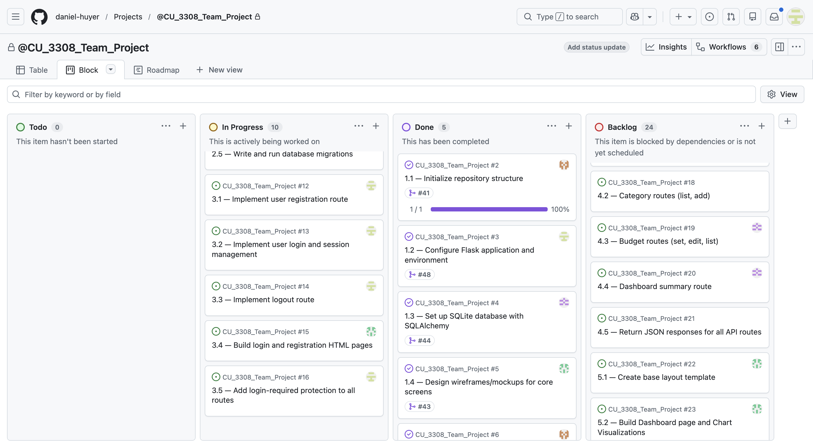

# 7-15_WEEKLY_STATUS.md

## Weekly Status Report

**Project:** JGT Finance  
**Team Number:** 4  
**Team Name:** JGT Finance

---

## Reporting Period

**Week:** 8  
**Meeting Held:** Yes  
**Meeting Date:** July 15th, 2026  
**Meeting Duration:** 30 minutes  
**Meeting Format:** Microsoft Teams

---

## Overview

This document captures the **weekly status** of the JGT Finance project for the specified reporting period.  
It is intended to provide a concise snapshot of progress, plans, and risks, and will be updated weekly throughout the project.

This weekly status format is designed to:

- Track ongoing progress over time
- Surface risks and blockers early
- Provide accountability for individual contributions
- Supplement the project management tool used by the team

---

## Project Management Snapshot

The team is using a shared **GitHub Projects Board** to manage tasks and sprint progress.  
At the time of this report:

- Columns include: Todo, In Progress, Done, Backlog
- Tasks are assigned to individual team members
- Due dates and priorities are tracked per task

---

## Progress Since Last Week

This week the team focused on integrating completed setup work into the main branch and beginning implementation of the application's core functionality.

Key accomplishments include:

- Reviewed and merged completed Milestone 4 into the main branch
- Finalized Flask application and SQLAlchemy database configuration
- Completed Flask-Migrate initialization and project database setup
- Reorganized project structure by moving static and templates into the app directory
- Began implementation of user authentication and login functionality

---

## Completed Tasks

- Updated project structure for application templates and static assets
- Established workflow for future model development and database migrations
- Created remaining database models: Category, Transaction, Budget
- Generated migrations for new models

---

## Planned Tasks for Next Week

- Merge Milestone 5 branches into main
- Continue authentication implementation and integration testing.
- Continue frontend pages for transaction entry and budget settings
- Develop backend API routes for Transactions, Categories, Budgets, and Dashboard.

---

## Blockers and Issues

- No significant technical blockers at this time.
- Team discussed Git branching, merge workflow, and coordination of parallel development to minimize merge conflicts during upcoming model and route implementation.

---

## Risks and Mitigation

**Identified Risk:** Merge conflicts as multiple team members begin implementing interconnected backend components.

- _Mitigation:_ Continue using feature branches, pull requests, and code reviews. Team members will synchronize their branches with the latest main branch before opening pull requests, and related backend work will be assigned to minimize overlapping file modifications.

---

## Individual Contributions This Week

- **Daniel Huyer:** Reviewed and coordinated pull requests, reorganized project structure, began implementation of user authentication and login functionality.
- **Kevin Bell:** Completed SQLite database setup using Flask-SQLAlchemy and Flask-Migrate, created application database configuration, initialized migration framework, and prepared for implementation of all database models and migrations.
- **Bri Rowe:** Continued frontend/UI development and integration planning based on completed wireframes.
- **Alejandro Banuelos Vielmas:** Continued work on assigned backend documentation and project tasks.

---

## Notes

This file will be updated weekly as the project progresses.  
Earlier weekly entries may be retained below or moved to an archive directory if the file grows large.
